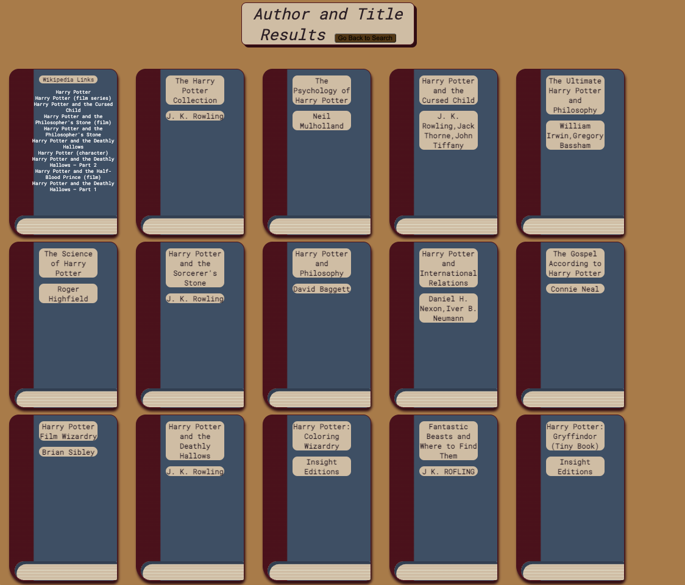

# book-search

## Description

Greetings, User!

Welcome to the README for our Digital Librarian.
Digital Librarian is programmed to provide you, the user with a comfortable environment
to browse through thousands of books.

## Installation

&emsp;N/A

## Usage

<li>Search for a book by it's Title</li>
<li>Search history will automatically populate as you search for books</li>
<li>Once you click on Search button you will be taken to a different page that presents books based on your search prompt</li>
<li>Digital Librarian provides Wikipedia Links in addition to list of books</li>

## Screenshots

  
Landing Page Screenshot

  
Book Search Screenshot

## Credits

&emsp;N/A

## License

&emsp;N/A
